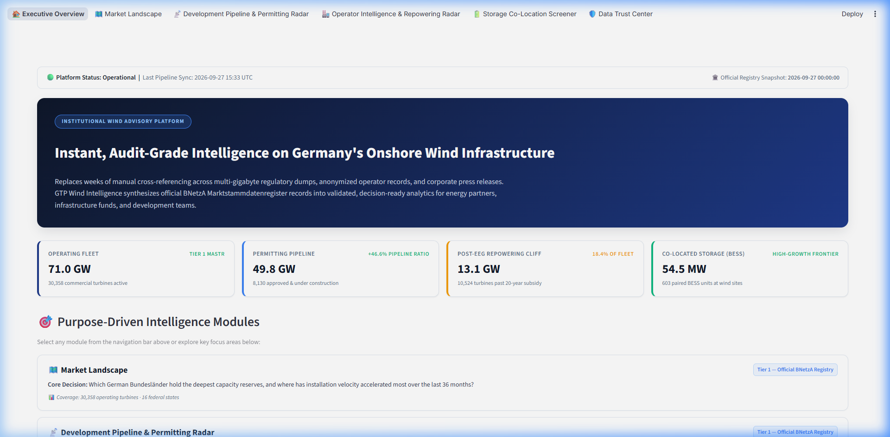
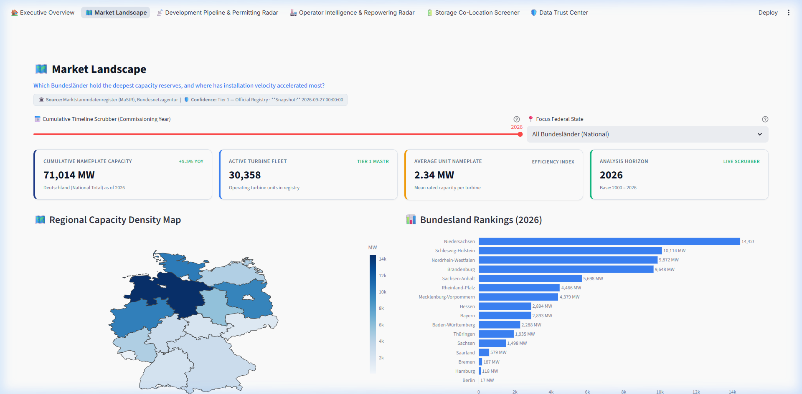
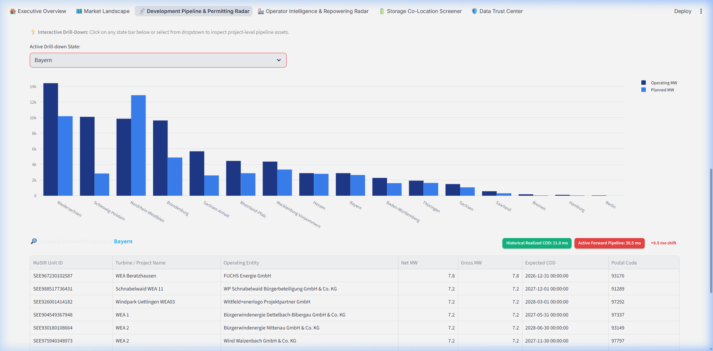
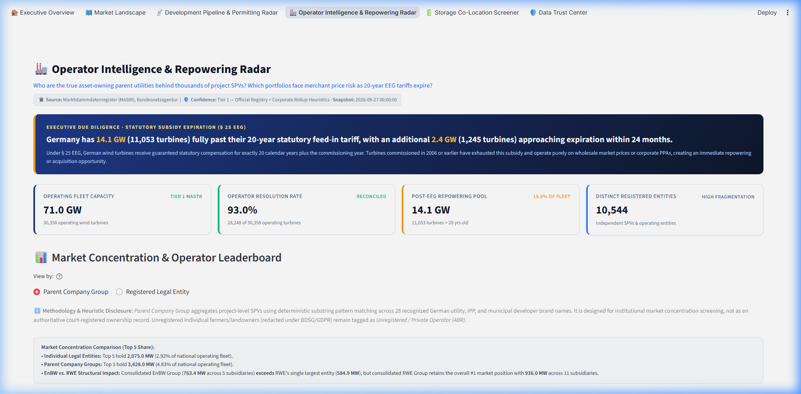
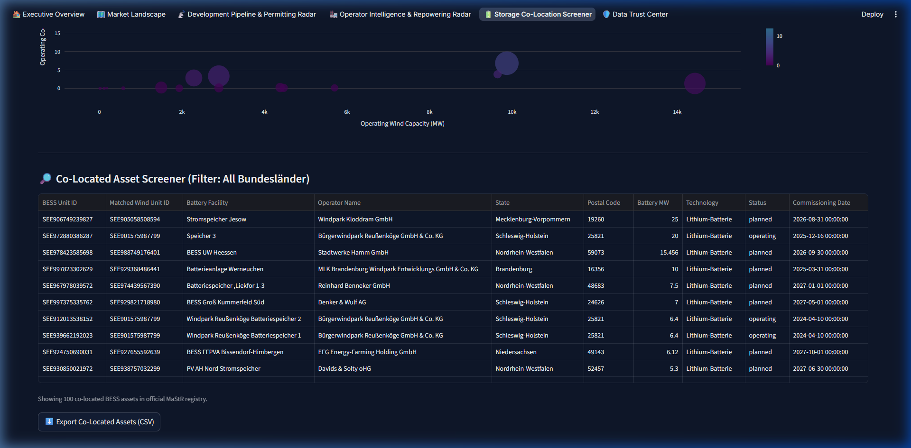
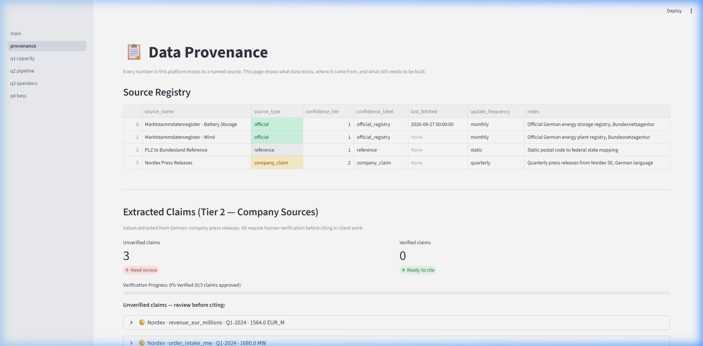

# GTP Wind Intelligence

> **Institutional Market Intelligence Platform for Germany's Onshore Wind Infrastructure, Permitting Pipeline, Corporate Asset Ownership, and Co-Located Battery Energy Storage (BESS).**

🌐 **Live Web Application:** [https://gtp-wind-intelligence-dm3mfa7b5ebx5xrh3rquvj.streamlit.app/](https://gtp-wind-intelligence-dm3mfa7b5ebx5xrh3rquvj.streamlit.app/)

[](https://gtp-wind-intelligence-dm3mfa7b5ebx5xrh3rquvj.streamlit.app/)
[](https://www.python.org/)
[](https://duckdb.org/)
[](https://streamlit.io/)
[](https://www.marktstammdatenregister.de/)
[](https://www.gesetze-im-internet.de/eeg_2014/__25.html)

---

## 1. Executive Summary & Core Value Proposition

Evaluating renewable energy investments, M&A portfolios, and repowering pipelines in Germany typically requires weeks of tedious manual data engineering. Analysts must download multi-gigabyte regulatory dumps from the Federal Network Agency (*Bundesnetzagentur* MaStR), resolve tens of thousands of decentralized project special purpose vehicles (*GmbH & Co. KG*) to true parent utilities, audit statutory subsidy expiration dates under the Renewable Energy Sources Act (*EEG*), and corroborate unstructured corporate press releases.

**GTP Wind Intelligence replaces this fragmented manual research with a live, auditable intelligence suite:**
- **Instant Due Diligence:** Evaluates 30,358 operating turbines (71.0 GW), 8,130 forward pipeline assets (33.1 GW), and all wind-co-located battery storage systems in milliseconds.
- **Corporate Hierarchy Transparency:** Groups decentralized project SPVs into consolidated parent utility portfolios using deterministic heuristic mapping (e.g., RWE, EnBW, Alterric, PROKON, wpd).
- **Statutory Repowering Screener:** Pinpoints Germany's **14.1 GW post-EEG subsidy cliff** (§ 25 EEG), identifying aging assets operating purely on merchant power prices.
- **Hybrid Storage Optimization:** Uncovers early-stage wind + BESS co-location assets to mitigate negative electricity price curtailment (*Abregelung*).
- **Two-Tier Audit Governance:** Enforces strict provenance tracking between official statutory facts (Tier 1) and unverified corporate claims (Tier 2).

---

## 2. Screenshot Walkthrough

### View 1: Executive Overview
*High-level portfolio KPIs, platform health indicators, statutory benchmarks, and module navigation.*


### View 2: Regional Capacity & Density Landscape
*Interactive Germany choropleth map, Bundesland capacity rankings, and 25-year installation timeline slider.*


### View 3: Permitting Radar & Bottleneck Screener
*Dual-lens permitting cycle times (historical snapshot vs. active pipeline) with project-level BImSchG drill-down.*


### View 4: Corporate Operator Intelligence & Repowering Radar
*Consolidated parent utility market share, 20-year EEG statutory expiration cliff, and repowering candidate screener.*


### View 5: Storage Co-Location Screener (Wind + BESS)
*Hybrid density scatter plot and asset-level BESS screener with paired MaStR Unit IDs.*


### View 6: Data Trust Center & Provenance
*Real-time platform health audit, bilingual legal citations, and Tier 2 corporate claim verification workflow.*


---

## 3. Key Audited Figures & Regulatory Ground Truth

### A. The 20-Year EEG Subsidy Cliff (§ 25 Abs. 1 Satz 3 EEG)
* **Statutory Calendar-Year Cutoff (Platform Standard):** **14,084.9 MW (14.1 GW) across 11,053 turbines**  
  Under German energy law (§ 25 EEG), statutory feed-in tariffs run for 20 calendar years plus the commissioning year (`YEAR(inbetriebnahmedatum) <= YEAR(CURRENT_DATE) - 20`, i.e. `<= 2006`).
* **Rolling 20-Year Day Cutoff (Secondary Lens):** **13,077.3 MW (13.1 GW) across 10,524 turbines** (`inbetriebnahmedatum <= CURRENT_DATE - INTERVAL 20 YEAR`).
* Both figures are synchronized and cross-referenced in [`docs/EEG_SPLIT_AND_BAYERN_PERMITTING_AUDIT.md`](docs/EEG_SPLIT_AND_BAYERN_PERMITTING_AUDIT.md).

### B. Dual-Lens Permitting Cycle Times in Bavaria (Bayern)
* **Historical Commissioned Baseline:** **21.0 months** (🟢 Green / Fast) for projects that already reached COD.
* **Active Forward Pipeline:** **30.5 months** (🔴 Red / Bottleneck, `>27 mo`), reflecting expanded BImSchG environmental reviews and 10H legacy friction (+9.5 mo shift).
* The dashboard displays both metrics side-by-side with color-coded contextual badges to prevent misleading due diligence conclusions.

### C. Co-Located Battery Storage (BESS) & BNetzA MaStR Matching
* **Operating Fleet:** **54.5 MW across 637 wind-co-located battery units** (mean unit size ~90 kW).
* **Deterministic Matching Rule:** Strict joint condition `(operator_mastr_id = wind_operator_id AND postleitzahl = wind_plz)`. Residential rooftop batteries are naturally excluded because homeowners own zero wind turbines.
* **Federal Government Verification:** Unit `SEE906749239827` (*Stromspeicher Jesow*, 25 MW, PLZ 19260) matched to wind turbine `SEE905058508594` (*WPK_09*, 3.9 MW), operated by `Windpark Kloddram GmbH` (`ABR927157249000`).
* **Official Registry Proof:** [BNetzA MaStR Record 8624153](https://www.marktstammdatenregister.de/MaStR/Einheit/Detail/IndexOeffentlich/8624153) | [Verification Artifact](docs/screenshots/bnetza_mastr_proof_general.png).

---

## 4. Institutional Documentation Suite

For detailed technical specifications, mathematical formulas, and audit logs, refer to `docs/`:

| Document | Scope & Coverage |
| :--- | :--- |
| **[`docs/MASTER_WALKTHROUGH_AND_KPI_REFERENCE.md`](docs/MASTER_WALKTHROUGH_AND_KPI_REFERENCE.md)** | Mathematical definitions, DDL schemas, exact SQL queries, and visual mappings for every KPI across all 6 views. |
| **[`docs/EEG_SPLIT_AND_BAYERN_PERMITTING_AUDIT.md`](docs/EEG_SPLIT_AND_BAYERN_PERMITTING_AUDIT.md)** | In-depth legal and analytical reconciliation of the 13.1 GW vs. 14.1 GW EEG split and Bayern's 30.5-month permitting duration. |
| **[`docs/CODE_REVISION_LOG.md`](docs/CODE_REVISION_LOG.md)** | File-by-file audit and change history for all code and configuration files. |
| **[`docs/SYSTEM_ARCHITECTURE_AND_DEEP_DIVE.md`](docs/SYSTEM_ARCHITECTURE_AND_DEEP_DIVE.md)** | Deep-dive on DuckDB columnar OLAP engine, MaStR joins, parent rollup heuristics, and multilingual RAG pipelines. |
| **[`docs/PIPELINE_EXECUTION_LOG.md`](docs/PIPELINE_EXECUTION_LOG.md)** | Pipeline run history, SHA-256 integrity hashes, row ingestion rates, and stage runtimes. |
| **[`docs/VERIFICATION_AUDIT_REPORT.md`](docs/VERIFICATION_AUDIT_REPORT.md)** | Automated test results validating database constraints, widget decoupling, and error handling. |

---

## 5. Technology Stack

| Layer | Technology | Function |
| :--- | :--- | :--- |
| **Database** | **DuckDB** (`v0.10+`) | Optimized 5.01 MB in-process columnar database providing sub-second aggregations over 38,000+ wind and co-located storage records. |
| **Backend** | **Python** (`3.11+`) | Vectorized processing with Pandas, NumPy, and regulatory parsing utilities. |
| **Presentation** | **Streamlit** (`v1.36+`) | Zero-sidebar institutional interface using top navigation (`st.navigation(..., position="top")`). |
| **Visualizations** | **Plotly** (`v5.18+`) | Interactive choropleths, grouped horizontal bar charts, and synchronized scatter plots. |
| **Design System** | **Tailored Dark Theme** | Curated palette (`#0F172A` Slate Dark, `#0284C7` Cyan Blue, `#10B981` Emerald, `#F59E0B` Amber) via `.streamlit/config.toml` and `app/utils/theme.py`. |

---

## 6. How to Run Locally

### Prerequisites
- Python 3.10, 3.11, or 3.12
- Git

### 1. Clone the Repository
```bash
git clone https://github.com/<your-username>/gtp-wind-intelligence.git
cd gtp-wind-intelligence
```

### 2. Create and Activate Virtual Environment
```bash
# Windows (PowerShell)
python -m venv venv
.\venv\Scripts\Activate.ps1

# Linux / macOS
python -m venv venv
source venv/bin/activate
```

### 3. Install Dependencies
```bash
pip install -r requirements.txt
```

### 4. Run the Application
```bash
streamlit run app/main.py
```
Open your browser at `http://localhost:8501`.

### 5. Run Automated Tests
```bash
python scripts/test_edge_cases.py
python scripts/verify_check.py
```

---

## 7. How to Deploy Live to the Web

The repository is configured for deployment with a lean 5.01 MB DuckDB database (no multi-gigabyte raw CSV uploads required).

### Option A: Streamlit Community Cloud (Live Production)

The application is deployed and running live:
👉 **[https://gtp-wind-intelligence-dm3mfa7b5ebx5xrh3rquvj.streamlit.app/](https://gtp-wind-intelligence-dm3mfa7b5ebx5xrh3rquvj.streamlit.app/)**

To deploy your own fork:
1. Fork or clone this repository to your GitHub account (`gaurav-619/gtp-wind-intelligence`).
2. Log into [share.streamlit.io](https://share.streamlit.io/).
3. Select repo: `gaurav-619/gtp-wind-intelligence`, Branch: `main`, Main file path: `app/main.py`.
4. Click **Deploy!**. Because `db/gtp.duckdb` is optimized to 5.01 MB, the application boots in ~45 seconds.

---

### Option B: Docker Container Deployment

You can build and deploy the application as a standalone container:

```dockerfile
# Build Docker image
docker build -t gtp-wind-intelligence .

# Run container
docker run -p 8501:8501 gtp-wind-intelligence
```

---

## 8. Data Confidence Tiers

```
┌────────────────────────────────────────────────────────────────────────┐
│ TIER 1 — OFFICIAL REGULATORY REGISTRY (100% FACT-GRADE)                │
│ Sourced from Bundesnetzagentur Marktstammdatenregister (MaStR)         │
│ • Metered grid assets (38,488 wind turbines, 637 co-located BESS)      │
│ • 93.0% operator resolution rate for operating commercial fleet        │
│ • Statutory § 25 EEG 20-year commissioning date calculations           │
│ • Cleared for direct citation in partner presentations & models        │
└────────────────────────────────────────────────────────────────────────┘
                                    │
                                    ▼
┌────────────────────────────────────────────────────────────────────────┐
│ TIER 2 — COMPANY DISCLOSURES & PRESS ANNOUNCEMENTS (CLAIM-GRADE)       │
│ Sourced from corporate filings, interim reports, and press releases   │
│ • Unstructured text extracted via multilingual LLM pipelines           │
│ • Explicitly flagged with preliminary hedge warnings (e.g. 'rund')     │
│ • LOCKED from client citation until human auditor signs off in UI     │
└────────────────────────────────────────────────────────────────────────┘
```

---

## 9. License & Regulatory Attribution

* **Regulatory Data Source:** *Bundesnetzagentur (BNetzA) Marktstammdatenregister (MaStR)*, licensed under [Data licence Germany – attribution – Version 2.0](https://www.govdata.de/dl-de/by-2-0).
* **Legal Citations:** *Gesetz für den Ausbau erneuerbarer Energien (Erneuerbare-Energien-Gesetz - EEG 2023)* and *Bundes-Immissionsschutzgesetz (BImSchG)*.
* **Codebase:** Institutional Prototype — Developed for due diligence and renewable portfolio intelligence.
