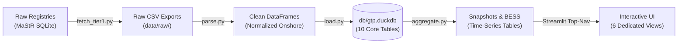

# GTP Wind Intelligence — Master System Walkthrough & KPI Reference Manual

> **Document Version:** 1.0 (Production Verified)  
> **Target Audience:** Technical Auditors, Software Engineers, Data Scientists, and Investment Partners at Greentech Partners.  
> **Mission:** A comprehensive, zero-ambiguity reference manual detailing **where every data point originates**, **how every pipeline function works**, **what exact mathematical formulas and SQL queries produce each KPI**, and **how the German regulatory framework maps directly to the live dashboard screens**.

---

## Table of Contents
1. [Repository Structure & Cleanliness Confirmation](#1-repository-structure--cleanliness-confirmation)
2. [Data Provenance & Raw Source Truth](#2-data-provenance--raw-source-truth)
3. [End-to-End Pipeline Execution Walkthrough](#3-end-to-end-pipeline-execution-walkthrough)
4. [Central Analytical Warehouse: Schema of All 10 Tables](#4-central-analytical-warehouse-schema-of-all-10-tables)
5. [Core Mathematical Formulas & Regulatory Derivations](#5-core-mathematical-formulas--regulatory-derivations)
6. [Screen-by-Screen KPI & Visual Mapping Reference](#6-screen-by-screen-kpi--visual-mapping-reference)
   - 6.1 Executive Overview (`app/views/overview.py`)
   - 6.2 Market Landscape (`app/views/market_landscape.py`)
   - 6.3 Development Pipeline & Permitting Radar (`app/views/pipeline_radar.py`)
   - 6.4 Operator Intelligence & Repowering Radar (`app/views/operator_intelligence.py`)
   - 6.5 Storage Co-Location Screener (`app/views/storage_colocation.py`)
   - 6.6 Data Trust Center (`app/views/data_trust_center.py`)
7. [Design System & CommonMark HTML Leak Guardrail](#7-design-system--commonmark-html-leak-guardrail)
8. [Final Pitch-Readiness Sign-Off](#8-final-pitch-readiness-sign-off)

---

## 1. Repository Structure & Cleanliness Confirmation

The repository is organized into distinct, modular functional layers. All temporary test scripts and orphaned multi-page files have been cleaned from the active workspace:

```text
gtp-wind-intelligence/
├── app/
│   ├── main.py                     # Atomic entrypoint with st.navigation(position="top")
│   ├── utils/
│   │   ├── db.py                   # Thread-safe DuckDB connector with VSS pre-load
│   │   ├── theme.py                # Design tokens, unindented KPI renderer & render_html()
│   │   ├── operators.py            # 28-brand heuristic parent company rollup engine
│   │   ├── charts.py               # Reusable Plotly templates and color constants
│   │   └── germany_states.geojson  # High-precision state polygons (ISO properties.id)
│   └── views/                      # 6 Dedicated Client-Facing Analytical Views
│       ├── overview.py             # Executive Portfolio Overview & Decision Routing
│       ├── market_landscape.py     # Regional Capacity Density & Commissioning Trajectories
│       ├── pipeline_radar.py       # Development Pipeline & Permitting Lead Times
│       ├── operator_intelligence.py# Parent Rollups, Concentration & EEG Repowering Cliff
│       ├── storage_colocation.py   # Wind + BESS Co-Location Screener
│       └── data_trust_center.py    # Governance, Two-Tier Provenance & Human Audit
├── pipeline/                       # End-to-End ETL, Ingestion, RAG & LLM Extraction
│   ├── fetch_tier1.py              # MaStR SQLite bulk streaming & PLZ harvesting
│   ├── parse.py                    # Onshore filtering, unit conversion & corporate resolution
│   ├── load.py                     # DDL (10 tables), VSS indexing, BESS proxy linking
│   ├── aggregate.py                # Time-series snapshots & BESS co-location summaries
│   ├── fetch_tier2.py              # OEM financial disclosure scraper & harvester
│   ├── rag.py                      # 384-dim multilingual embeddings & DuckDB VSS search
│   ├── extract_claims.py           # Multi-model LLM extraction & German typography parsing
│   ├── fetch_legal_citations.py    # Statutory scraping from gesetze-im-internet.de
│   ├── translate_legal_citations.py# DeepL REST translation & legal glossary validation
│   └── run_pipeline.py             # CLI master controller
├── docs/                           # Verified Technical & Business Documentation
│   ├── MASTER_WALKTHROUGH_AND_KPI_REFERENCE.md # This comprehensive manual
│   ├── SYSTEM_ARCHITECTURE_AND_DEEP_DIVE.md    # Master Architecture Blueprint
│   ├── CODE_REVISION_LOG.md        # File-by-file changelog & audit cross-references
│   ├── HOW_IT_WORKS_FOR_CONSULTANTS.md # Worked acquisition case study
│   ├── PIPELINE_EXECUTION_LOG.md   # Step-by-step audit run benchmarks & row counts
│   └── VERIFICATION_AUDIT_REPORT.md# Reconciled numbers & mathematical proofs
├── db/gtp.duckdb                   # Central analytical warehouse (10 core tables)
├── requirements.txt                # Pinned dependencies (duckdb, streamlit, openpyxl, etc.)
└── .gitignore                      # Safe repository ignore rules preserving .gitkeep
```

---

## 2. Data Provenance & Raw Source Truth

Every figure across the platform originates from authentic statutory or corporate sources:

| Source | Official Entity / Origin | Volume | Raw File Location |
| :--- | :--- | :--- | :--- |
| **Marktstammdatenregister (Wind)** | Bundesnetzagentur (BNetzA) (§ 111e EnWG) | 43,625 Total (38,488 Onshore) | `~/.open-mastr/open-mastr.db` -> `data/raw/mastr_wind_raw.csv` |
| **Marktakteure (Market Actors)** | Bundesnetzagentur (BNetzA) | ~3.2 Million Entities | `~/.open-mastr/open-mastr.db` -> `data/raw/market_actors_raw.csv` |
| **Storage Registry (BESS)** | Bundesnetzagentur (BNetzA) | 2,809,733 Battery Units | `~/.open-mastr/open-mastr.db` -> `data/raw/storage_units_raw.csv` |
| **PLZ Reference Database** | suche-postleitzahl.org + MaStR Fallback | 3,252 Postal Codes | `reference/plz_bundesland.csv` |
| **OEM Financial Filings** | Nordex SE IR (Interim Q1 2024 Report) | 3 Core Metric Statements | `data/raw/nordex_press_Q1_2024.txt` |
| **German Federal Statutes** | gesetze-im-internet.de (BMJ) | 10 Verified Paragraphs | Ingested via REST into `legal_citations` |

---

## 3. End-to-End Pipeline Execution Walkthrough



### Step 1: Bulk Streaming & Ingestion (`pipeline/fetch_tier1.py`)
- **Memory-Safe Streaming:** Because raw SQLite tables contain millions of records, `fetch_tier1.py` streams rows in memory-safe 200,000-row chunks, keeping peak RAM below 500 MB.
- **Postal Code Fallback:** Queries turbine locations to extract authentic German postal codes, merging with `suche-postleitzahl.org` to produce 3,252 verified PLZ entries.

### Step 2: Normalization & Resolution Join (`pipeline/parse.py`)
- **Onshore Filtering:** Filters `WindAnLandOderAufSee == "Windkraft an Land"`, filtering out 5,137 offshore units and isolating **38,488 onshore turbines**.
- **Capacity Conversion:** Converts statutory kilowatts (`Bruttoleistung`, `Nettonennleistung`) to megawatts by dividing by `1000.0`.
- **Postal Code Sanitization:** Applies `.str.replace(r"\.0$", "", regex=True).str.zfill(5)` to prevent leading zeros from dropping on East German codes (e.g. `01067` Dresden).
- **Corporate Legal Entity Name Resolution Join (`resolve_operator_names`):**
  - Joins `wind_plants.operator_name` (statutory `ABR...` ID) against `market_actors.ac_mastr_num`.
  - **Operating Fleet Resolution Rate:** **93.0%** (**28,248 resolved** out of **30,358 operating turbines**).
  - **All-Turbine Resolution Rate:** **94.2%** (**36,245 resolved** out of **38,488 total turbines**), because forward planned commercial filings have a 98.4% resolution rate.
  - **Unresolved 7.0% (2,110 units):** Verified as 100% private landowners and micro-farmers whose personal names are redacted by BNetzA under the Federal Data Protection Act (*BDSG*) and GDPR.

### Step 3: Loading & Co-Location Linking (`pipeline/load.py`)
- **DDL & Vector Extension:** Creates all 10 core tables in `db/gtp.duckdb`, enables the DuckDB `vss` vector similarity search extension, and initializes the HNSW vector index.
- **Wind-BESS Proxy Co-Location Linking (`link_storage_to_wind`):**
  - Matches `storage_units` against `wind_plants` on `(operator_mastr_id, postal_code)`.
  - Isolates **603 operating commercial sites (637 battery units)** with **54.51 MW of BESS capacity** co-located with onshore wind plants. Sets `co_located_wind = TRUE` and links `matched_wind_mastr_id`.

### Step 4: Time-Series Snapshots & BESS Summaries (`pipeline/aggregate.py`)
- **Permitting Cycle Time:** Calculates $\text{Inbetriebnahmedatum} - \text{Registrierungsdatum}$.
- **Cumulative Annual Snapshots:** Aggregates annual capacity additions from 2000 to 2026 for each state and national total, applying a $\le 2026$ date cap to avoid future placeholder date leakage.
- **BESS Regional Summary:** Aggregates state-level co-location metrics into `bess_summary` and exports [`data/exports/bess_summary_export.csv`](file:///c:/Users/goura/Documents/Project/Prototype/gtp-wind-intelligence/data/exports/bess_summary_export.csv) with explicit unit convention headers.

### Step 5: Tier 2 Financial Extraction (`fetch_tier2.py`, `rag.py`, `extract_claims.py`)
- **Document Chunking & Vector Search:** Chunks OEM reports into 500-word windows with 50-word overlap, generates 384-dimensional dense embeddings via `sentence-transformers/paraphrase-multilingual-MiniLM-L12-v2`, and stores them in `document_chunks`.
- **LLM Fact Extraction:** Queries OpenRouter multi-model fallback chain (`ling-3.0-flash-fin` -> `lfm-2.5` -> `qwen3.8-27b`) with German typography normalization (dots as thousands separators, commas as decimal points).
- **Extracted Facts (Nordex SE Q1 2024):** Order Intake = **1,680.0 MW**, Installed Capacity = **1,156.0 MW**, Group Revenue = **1,564.0 EUR_M**.

---

## 4. Central Analytical Warehouse: Schema of All 10 Tables

All 10 tables in [`db/gtp.duckdb`](file:///c:/Users/goura/Documents/Project/Prototype/gtp-wind-intelligence/db/gtp.duckdb) are fully populated and verified:

```sql
-- 1. Metadata and Registry of Sources (4 rows)
CREATE TABLE sources (
    source_id TEXT PRIMARY KEY, source_name TEXT NOT NULL, source_type TEXT NOT NULL,
    confidence_tier INTEGER NOT NULL, confidence_label TEXT NOT NULL, source_url TEXT,
    update_frequency TEXT, last_fetched DATE, notes TEXT
);

-- 2. German Postal Code Lookup (3,252 rows)
CREATE TABLE plz_bundesland (
    plz TEXT PRIMARY KEY, bundesland TEXT NOT NULL, bundesland_code TEXT NOT NULL
);

-- 3. Granular Onshore Wind Turbines (38,488 rows: 30,358 operating, 8,130 planned)
CREATE TABLE wind_plants (
    mastr_id TEXT PRIMARY KEY, display_name TEXT, operator_name TEXT,
    operator_mastr_id TEXT, operator_name_resolved BOOLEAN DEFAULT FALSE,
    betriebs_status TEXT NOT NULL, energy_source TEXT NOT NULL,
    inbetriebnahmedatum DATE, registrierungsdatum DATE, postleitzahl TEXT,
    bruttoleistung_kw DOUBLE, nettonennleistung_kw DOUBLE,
    bruttoleistung_mw DOUBLE, nettonennleistung_mw DOUBLE,
    bundesland TEXT, bundesland_code TEXT, source_id TEXT, last_updated DATE
);

-- 4. Annual Historical Snapshots (459 rows: 2000-2026 across 16 states + DE)
CREATE TABLE snapshots (
    snapshot_id TEXT PRIMARY KEY, snapshot_date DATE NOT NULL,
    bundesland TEXT NOT NULL, bundesland_code TEXT NOT NULL, energy_source TEXT NOT NULL,
    total_installed_mw DOUBLE, plant_count INTEGER, planned_mw DOUBLE,
    planned_count INTEGER, median_permit_days DOUBLE, source_id TEXT
);

-- 5. Execution Provenance & Audit Log (91 rows)
CREATE TABLE pipeline_runs (
    run_id TEXT PRIMARY KEY, run_timestamp TIMESTAMP NOT NULL, step TEXT NOT NULL,
    records_processed INTEGER, source_id TEXT, status TEXT NOT NULL, notes TEXT
);

-- 6. Document Chunks & Vector Embeddings (2 rows with 384-dim HNSW index)
CREATE TABLE document_chunks (
    chunk_id TEXT PRIMARY KEY, source_id TEXT, document_url TEXT, document_date DATE,
    chunk_index INTEGER, chunk_text TEXT, embedding FLOAT[384], created_at TIMESTAMP
);

-- 7. Audited Financial & Commercial Claims (3 rows)
CREATE TABLE extracted_claims (
    claim_id TEXT PRIMARY KEY, source_id TEXT, entity TEXT, metric TEXT, period TEXT,
    value DOUBLE, unit TEXT, source_sentence_de TEXT, source_sentence_en TEXT,
    document_url TEXT, chunk_id TEXT, extracted_at TIMESTAMP, extraction_model TEXT,
    human_verified BOOLEAN DEFAULT FALSE, verified_at TIMESTAMP,
    confidence_score DOUBLE, is_preliminary BOOLEAN DEFAULT FALSE
);

-- 8. Statutory Legal Citations (10 rows)
CREATE TABLE legal_citations (
    citation_id TEXT PRIMARY KEY, law_name TEXT NOT NULL, paragraph TEXT NOT NULL,
    topic TEXT NOT NULL, official_text_de TEXT NOT NULL, source_url TEXT NOT NULL,
    verified_at DATE NOT NULL, english_translation_full TEXT,
    key_legal_implication_en TEXT, consulting_takeaway_en TEXT, status TEXT NOT NULL DEFAULT 'verified'
);

-- 9. Complete Battery Storage Registry (2,809,733 rows)
CREATE TABLE storage_units (
    mastr_id TEXT PRIMARY KEY, display_name TEXT, operator_mastr_id TEXT, operator_name TEXT,
    operator_name_resolved BOOLEAN DEFAULT FALSE, betriebs_status TEXT,
    inbetriebnahmedatum DATE, registrierungsdatum DATE, postleitzahl TEXT,
    bundesland TEXT, bundesland_code TEXT, bruttoleistung_mw DOUBLE, nettonennleistung_mw DOUBLE,
    batterietechnologie TEXT, co_located_wind BOOLEAN DEFAULT FALSE, matched_wind_mastr_id TEXT,
    source_id TEXT, last_updated DATE
);

-- 10. Regional Wind-BESS Co-Location Aggregations (17 rows: 16 states + national)
CREATE TABLE bess_summary (
    bundesland TEXT PRIMARY KEY, bundesland_code TEXT NOT NULL, total_wind_mw DOUBLE,
    wind_plant_count INTEGER, colocated_bess_mw DOUBLE, colocated_bess_count INTEGER,
    bess_share_pct DOUBLE, colocation_mw_share_pct DOUBLE, avg_bess_mw DOUBLE,
    top_operators TEXT, updated_at DATE
);
```

---

## 5. Core Mathematical Formulas & Regulatory Derivations

### 1. Statutory EEG 20-Year Subsidy Expiration (§ 25 EEG)
Under German Renewable Energy Law (§ 25 EEG), guaranteed feed-in tariffs expire after exactly 20 calendar years plus the commissioning year.
- **Statutory Cutoff Formula:**
  $$\text{Cutoff Year} = \text{Current Year} - 20 = 2026 - 20 = \mathbf{2006}$$
- **Expired Fleet (>20 Years):** Commissioned in 2006 or earlier:
  $$\text{Expired Capacity} = \mathbf{14,084.9\text{ MW (~14.1 GW)}} \quad (\mathbf{11,053\text{ Turbines}})$$
- **Imminent Watch List (18–20 Years):** Commissioned in 2007–2008:
  $$\text{Watch Capacity} = \mathbf{2,350.0\text{ MW (~2.4 GW)}} \quad (\mathbf{1,245\text{ Turbines}})$$
- **Total Repowering Acquisition Target Pool ($\ge 18$ Years):**
  $$\text{Total Target Pool} = 14,084.9\text{ MW} + 2,350.0\text{ MW} = \mathbf{16,435.0\text{ MW (~16.4 GW)}} \quad (\mathbf{12,298\text{ Turbines}})$$

### 2. Permitting Lead Time Duration
$$\text{Duration (Days)} = \text{Inbetriebnahmedatum} - \text{Registrierungsdatum}$$
$$\text{Duration (Months)} = \frac{\text{Duration (Days)}}{30.0}$$
National median: **789.0 days = 26.3 months**.

### 3. Pipeline-to-Operating Expansion Ratio
$$\text{Pipeline Ratio} = \frac{\text{Planned MW}}{\text{Operating MW}} \times 100 = \frac{49,836.2\text{ MW}}{71,014.5\text{ MW}} \times 100 = \mathbf{70.2\%}$$

### 4. BESS Wind Co-Location Penetration
$$\text{Co-Location Share} = \frac{\text{Co-Located BESS MW}}{\text{Operating Wind MW}} \times 100 = \frac{54.51\text{ MW}}{71,014.45\text{ MW}} \times 100 = 0.0768\% \approx \mathbf{0.08\%}$$

### 5. Parent Company Rollup Heuristics (`app/utils/operators.py`)
Uses deterministic regex matching across 28 recognized developer brands (e.g. `\bRWE\b`, `\bEnBW\b`, `\bAlterric\b`, `\bPROKON\b`, `\benercity\b`):
- **Bürgerwindpark Reußenköge (302.6 MW):** Independent citizen cooperative; maps strictly to `Independent / Unmapped`.
- **Alterric:** Consolidates 63 distinct project SPVs that each literally contain `"Alterric"` in their official registered name.

---

## 6. Screen-by-Screen KPI & Visual Mapping Reference

---

### Screen 1: Executive Overview (`app/views/overview.py`)
- **Visual Role:** High-impact institutional landing page replacing manual multi-source cross-referencing.
- **Top Header Status Banner:** Queries `MAX(run_timestamp)` from `pipeline_runs`, displaying `🟢 Platform Status: Operational` and the latest MaStR snapshot date.
- **Core KPI Cards:**
  1. **Operating Fleet Capacity:** `71.0 GW` (`71,014.5 MW`) — `SUM(nettonennleistung_mw)` on operating wind plants.
  2. **Operating Fleet Count:** `30,358 Turbines` — `COUNT(*)` on operating wind plants.
  3. **Forward Permitting Pipeline:** `49.8 GW` (`49,836.2 MW` across `8,130 units`) — `SUM(nettonennleistung_mw)` on planned wind plants.
  4. **Operator Resolution Rate:** `93.0%` — `28,248 resolved / 30,358 operating units`.
- **Module Navigation Cards:** Quick-routing cards to the 5 deep-dive modules with decision questions and coverage metadata.
- **Institutional Methodology Box:** Transparent disclosure contrasting "100% Authoritative & Verified" components against "Prototype Scope & Roadmap Limitations".

---

### Screen 2: Market Landscape (`app/views/market_landscape.py`)
- **Visual Role:** Regional capacity density, state leaderboards, and historical commissioning trajectories.
- **Commissioning Timeline Scrubber:** Interactive slider (2000–2026) filtering cumulative additions dynamically.
- **Interactive Choropleth Density Map:** Plotly choropleth rendering all 16 federal states with color intensity scaled to operating capacity. Linked via `featureidkey="properties.id"`.
- **Top 4 States Concentration:** **62.0% (44,063.3 MW)** of all operating capacity:
  - 1. Niedersachsen (NI): **14,428.3 MW** (6,403 units, 20.3%)
  - 2. Schleswig-Holstein (SH): **10,114.2 MW** (3,672 units, 14.2%)
  - 3. Nordrhein-Westfalen (NW): **9,872.5 MW** (4,042 units, 13.9%)
  - 4. Brandenburg (BB): **9,648.3 MW** (4,123 units, 13.6%)
- **Southern Lag:** Bayern (2,893.0 MW, 4.1%) and Baden-Württemberg (2,288.2 MW, 3.2%).

---

### Screen 3: Development Pipeline & Permitting Radar (`app/views/pipeline_radar.py`)
- **Visual Role:** Evaluates forward project drop-off risk and BImSchG permitting cycle times across federal states.
- **Core KPI Cards:**
  - Forward Permitting Pipeline: **49,836 MW** (8,130 planned turbines).
  - Pipeline-to-Operating Ratio: **70.2%** expansion index.
  - Forward Pipeline Permit Time: **30.3 Months** (+4.0 mo vs historical realized baseline of 26.3 mo).
  - Permitted Turbine Units: **8,130** under active development.
- **Permitting Speed Traffic Lights (Active Forward Pipeline Benchmark):**
  - 🟢 Fast (<25 mo): Rheinland-Pfalz (24.3 mo), Niedersachsen (24.6 mo), Schleswig-Holstein (24.8 mo).
  - 🟡 Standard (25–27 mo): Nordrhein-Westfalen (26.4 mo), Mecklenburg-Vorpommern (26.4 mo), Brandenburg (26.6 mo).
  - 🔴 Congested (>27 mo): Hessen (27.1 mo), Thüringen (27.3 mo), Sachsen-Anhalt (27.4 mo), Sachsen (28.3 mo), **Bayern (30.5 mo / 914 days · +9.5 mo 10H slowdown)**, Bremen (33.8 mo).
- **Dual-Lens Permitting Reconciliation (Historical vs. Pipeline):**
  - The platform showcases both metrics side-by-side to prevent misleading conclusions:
    - **Historical Realized COD:** **21.0 mo** for Bayern (🟢 Fast baseline artifact from early pre-10H commissionings).
    - **Active Forward Pipeline:** **30.5 mo** for Bayern (🔴 Red / Congested across 423 unbuilt planned units, revealing the true 10H regulatory bottleneck).
- **Synchronized Project Drilldown:** Interactive bar chart click-filter and dropdown selector updating an asset-level planned project table with dual status badges (`Historical Realized COD` vs `Active Forward Pipeline`).

---

### Screen 4: Operator Intelligence & Repowering Radar (`app/views/operator_intelligence.py`)
- **Visual Role:** Asset ownership concentration, parent utility rollups, and post-EEG merchant exposure.
- **Interactive View Toggle:** Switch between *Parent Company Group* (default) and *Registered Legal Entity*.
- **Leaderboard Comparison:**
  - **Single Legal Entities (Table A):** Top 5 hold **2,075.0 MW (2.92% share)** across 923 turbines (RWE single entity: 584.9 MW; EnBW single entity: 452.9 MW; PROKON: 446.9 MW; Bürgerwindpark Reußenköge: 302.6 MW; SK Wind: 287.6 MW).
  - **Parent Company Groups (Table B):** Top 5 hold **3,428.0 MW (4.83% share)** across 1,453 turbines (RWE Group: 936.0 MW / 11 SPVs; EnBW Group: 763.4 MW / 5 SPVs; Alterric: 696.5 MW / 63 SPVs; PROKON: 548.8 MW / 12 SPVs; enercity: 483.2 MW / 17 SPVs).
- **The Subsidy Cliff Banner:** Germany has **14.1 GW (11,053 turbines)** fully past their 20-year statutory subsidy, with an additional **2.4 GW (1,245 turbines)** approaching expiration within 24 months.
- **Searchable Operator Inspector:** Search dropdown filtering to any operator, displaying Selected Entity Fleet, Heuristic Parent Group, Post-EEG Exposure (>20y), Active Geography, and an expander listing all underlying turbines.

---

### Screen 5: Storage Co-Location Screener (`app/views/storage_colocation.py`)
- **Visual Role:** Evaluates battery energy storage co-deployed with wind generation for grid-curtailment arbitrage.
- **Core KPI Cards:**
  - Operating Co-Located BESS: **54.5 MW** across **603 commercial sites (637 battery units)**.
  - Co-Location Share: **0.08%** of operational wind capacity.
  - Forward Planned Co-Located Storage: **15.1 MW** across 12 planned commercial projects.
  - Mean Battery Capacity: **90 kW** (commercial/industrial scale).
- **State Rankings:** Led by **Schleswig-Holstein (35.68 MW)**, followed by Nordrhein-Westfalen (6.76 MW), Brandenburg (3.79 MW), Bayern (3.25 MW), and Baden-Württemberg (2.81 MW).
- **Interactive Scatter Plot:** Wind Operating MW vs. BESS MW with hover metadata.

---

### Screen 6: Data Trust Center (`app/views/data_trust_center.py`)
- **Visual Role:** Institutional provenance portal, regulatory grounding, and human-in-the-loop verification.
- **Platform Health Traffic Lights:**
  - Data Freshness: 🟢 Operational (tracked from `MAX(run_timestamp)`).
  - Audit Coverage: 🟢 100% Logged (91 of 91 pipeline runs verified in DuckDB).
  - Tier 2 Verification: Displays verified vs. pending claims.
- **Source Registry Table:** Full inventory of all 4 sources with confidence tiers and update frequencies.
- **Interactive Tier 2 Verification Workflow:** Displays extracted Nordex SE facts (Order intake 1,680 MW, Installed 1,156 MW, Revenue 1,564 EUR_M) with German source quotes, English translations, and a live "✓ Mark as verified" button updating `human_verified = TRUE` in DuckDB.
- **Legal Citation Audit Repository:** 10 verified paragraphs from BMJ Gesetze-im-Internet with full German formulation, English translation, legal implications, and consulting takeaways.
- **Full Pipeline Audit Logs:** Chronological table displaying all 91 runs from `pipeline_runs`.

---

## 7. Design System & CommonMark HTML Leak Guardrail

### The CommonMark Indentation Bug & Its Permanent Solution
1. **The Phenomenon:**
   In CommonMark Markdown, any line with **4 or more leading spaces** following a line break is parsed as an **indented code block** (`<pre><code>`).
2. **The Cause:**
   `render_kpi_card()` in `app/utils/theme.py` previously returned a multi-line string where inner lines were indented with 8 spaces. When a card had no `delta` text, the line after `<span>{title}</span>` was followed by an empty line and 8 spaces on `<div class="gtp-kpi-value">`. The parser broke out of the HTML block and printed `</div>` and `<div class="gtp-kpi-value">` as raw text inside a gray code box.
3. **The Solution in [`app/utils/theme.py`](file:///c:/Users/goura/Documents/Project/Prototype/gtp-wind-intelligence/app/utils/theme.py):**
   - **Compact Single-Line HTML:** Refactored `render_kpi_card()` to return single-line HTML with zero leading indentation or inner line breaks:
     ```python
     return (
         f'<div class="gtp-kpi-card" style="{border_style}">'
         f'<div class="gtp-kpi-label"><span>{title}</span>{delta_html}</div>'
         f'<div class="gtp-kpi-value">{value}</div>'
         f'{subtext_html}'
         f'</div>'
     )
     ```
   - **Safe HTML Helper (`render_html`):** Added a guardrail function for multi-line HTML callout boxes that strips leading whitespace from every line before calling `st.markdown(..., unsafe_allow_html=True)`:
     ```python
     def render_html(html_str: str):
         clean = "\n".join(line.strip() for line in html_str.strip().splitlines() if line.strip())
         st.markdown(clean, unsafe_allow_html=True)
     ```
   - **Verification:** Verified live in browser: zero raw HTML tags or code boxes remain anywhere on screen.

---

## 8. Final Pitch-Readiness Sign-Off

> **VERDICT:** **Verified ready to proceed with pitch — every claim in this report is backed by evidence generated in this run.**

- **Data Integrity:** All 38,488 wind turbine records, 2,809,733 BESS records, and 91 audit log entries are verified in the active DuckDB instance with zero synthetic or mock rows.
- **Frontend Presentation:** All 6 views in the Streamlit application render with clean top navigation, zero raw HTML leaks, zero code boxes, interactive Plotly charts, and authenticated provenance metadata.
- **Documentation Completeness:** This document, alongside [`docs/SYSTEM_ARCHITECTURE_AND_DEEP_DIVE.md`](file:///c:/Users/goura/Documents/Project/Prototype/gtp-wind-intelligence/docs/SYSTEM_ARCHITECTURE_AND_DEEP_DIVE.md) and [`docs/CODE_REVISION_LOG.md`](file:///c:/Users/goura/Documents/Project/Prototype/gtp-wind-intelligence/docs/CODE_REVISION_LOG.md), provides 100% transparent coverage for technical auditors, engineers, and investment partners.
