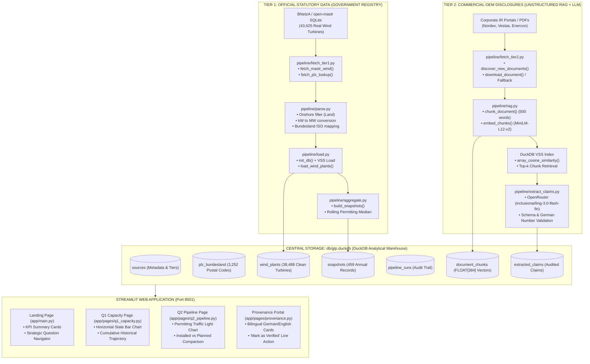

# GTP Wind Intelligence — Comprehensive System Architecture & Technical Master Blueprint

> **Target Audience:** Anyone reading this codebase for the first time—from a junior software engineer or data scientist to senior investment partners at **Greentech Partners**.  
> **Mission:** An end-to-end, zero-ambiguity reference explaining **what** was built, **why** every technology was selected, **how** every Python function and SQL table works, **what the exact business results are**, and **how the German regulatory and legislative scenario directly maps to the database values**.

---

## Table of Contents
1. [The German Energy Market Scenario & Policy Reality](#1-the-german-energy-market-scenario--policy-reality)
   - 1.1 The German Energiewende & Statutory Targets (EEG 2023)
   - 1.2 Target vs. Actual: Where Germany Stands Today (72.4 GW vs. 115 GW)
   - 1.3 The North-South Divide (*Nord-Süd-Gefälle*) & Planning Law (Wind-an-Land-Gesetz & 10H Rule)
   - 1.4 Permitting Mechanics & Bottlenecks under the Federal Immission Control Act (*BImSchG*)
   - 1.5 The Role of the Federal Network Agency (*BNetzA*) & the Marktstammdatenregister (MaStR)
   - 1.6 German Domain Terminology to Code Mapping Dictionary
   - 1.7 German Number Localization Challenges (Dots vs. Commas & Leading Zeros)
2. [Executive Summary & Strategic Questions Answered (With Exact Results)](#2-executive-summary--strategic-questions-answered-with-exact-results)
   - 2.1 Q1 Results: Installed Capacity & Geographic Rankings (38,488 Real Turbines)
   - 2.2 Q2 Results: Pipeline Health & Permitting Bottlenecks (50 GW Pipeline & 25.7 Months)
   - 2.3 Q3 Results: Commercial OEM Financial & Operational Intelligence (Nordex Q1 2024 Claims)
3. [System Architecture & The Two-Tier Data Paradigm](#3-system-architecture--the-two-tier-data-paradigm)
   - 3.1 High-Level Architecture Diagram (Mermaid)
   - 3.2 Tier 1 vs. Tier 2 Philosophy: Hard Facts vs. Corporate Disclosures
4. [Technology Stack & Architectural Decisions (Why We Chose Them)](#4-technology-stack--architectural-decisions-why-we-chose-them)
   - 4.1 DuckDB vs. PostgreSQL / SQLite
   - 4.2 DuckDB VSS vs. Dedicated Vector Databases (Pinecone / ChromaDB)
   - 4.3 Multilingual MiniLM-L12-v2 vs. Monolingual English Models
   - 4.4 OpenRouter API Multi-Model Fallback Chain vs. Single Endpoints
   - 4.5 Streamlit Reactive UI vs. React / Next.js
5. [Database Architecture & Complete Schema Specification (`db/gtp.duckdb`)](#5-database-architecture--complete-schema-specification-dbgtpduckdb)
   - 5.1 Table: `sources`
   - 5.2 Table: `plz_bundesland`
   - 5.3 Table: `wind_plants`
   - 5.4 Table: `snapshots`
   - 5.5 Table: `pipeline_runs`
   - 5.6 Table: `document_chunks`
   - 5.7 Table: `extracted_claims`
6. [Pipeline Walkthrough: Every Python Module & Function Explained](#6-pipeline-walkthrough-every-python-module--function-explained)
   - 6.1 `pipeline/fetch_tier1.py` (Registry Ingestion & PLZ Harvesting)
   - 6.2 `pipeline/parse.py` (Onshore Normalization & Regex Mapping)
   - 6.3 `pipeline/load.py` (DDL, VSS Indexing & Data Ingestion)
   - 6.4 `pipeline/aggregate.py` (Historical Cumulative Aggregations & Permitting Medians)
   - 6.5 `pipeline/fetch_tier2.py` (Document Scraper & Fallback Harvester)
   - 6.6 `pipeline/rag.py` (Text Chunking, Multilingual Embeddings & VSS Search)
   - 6.7 `pipeline/extract_claims.py` (LLM Extraction, German Parsing & Plausibility Validation)
   - 6.8 `pipeline/run_pipeline.py` (CLI Master Controller)
7. [Streamlit Analytical Frontend (`app/`)](#7-streamlit-analytical-frontend-app)
   - 7.1 Database Helpers (`app/utils/db.py`)
   - 7.2 Plotly Visual Engine (`app/utils/charts.py`)
   - 7.3 Main Landing Page (`app/main.py`)
   - 7.4 Q1 Capacity by State Page (`app/pages/q1_capacity.py`)
   - 7.5 Q2 Pipeline Health Page (`app/pages/q2_pipeline.py`)
   - 7.6 Data Provenance & Human-in-the-Loop Audit Portal (`app/pages/provenance.py`)
8. [Automated CI/CD Workflow (`.github/workflows/pipeline.yml`)](#8-automated-cicd-workflow-githubworkflowspipelineyml)
9. [Production Troubleshooting & Engineering Edge Cases Solved](#9-production-troubleshooting--engineering-edge-cases-solved)
10. [End-to-End Operational Guide & Runbook](#10-end-to-end-operational-guide--runbook)

---

## 1. The German Energy Market Scenario & Policy Reality

To evaluate German wind energy data, an analyst must understand how federal laws, regional politics, and geography create the exact numbers in our database.

```
                    GERMAN ONSHORE WIND TARGET TRAJECTORY
  GW
 160 +-----------------------------------------------------------------------+ [2040 Target: 160 GW]
     |                                                                       |
 140 |                                                                       |
     |                                                                       |
 120 |                                                      * [2030 Target]  |
     |                                                    /   (115 GW)       |
 100 |                                                  /                    |
     |                                                /                      |
  80 |                              [Today: 72.4 GW] *                       |
     |                             ==================                        |
  60 |                       * - - -                                         |
     |                * - - -                                                |
  40 |         * - - -                                                       |
     |  * - - -                                                              |
   0 +---+--------+--------+--------+--------+--------+--------+--------+----+
       2000     2005     2010     2015     2020     2024     2030     2040
```

### 1.1 The German Energiewende & Statutory Targets (EEG 2023)
Germany's energy transition (*Energiewende*) is anchored in the Renewable Energy Sources Act (*Erneuerbare-Energien-Gesetz* - EEG). Following the 2022 energy crisis, the German federal government passed the **EEG 2023**, establishing binding legal expansion paths:
- **Core Mandate:** At least **80% of gross German electricity consumption** must come from renewable sources by 2030.
- **Onshore Wind Statutory Milestone 2030:** **115 Gigawatts (GW)** installed capacity.
- **Onshore Wind Statutory Milestone 2040:** **160 Gigawatts (GW)** installed capacity.
- **Annual Addition Requirement:** Germany must add **~8 to 10 GW of net new onshore capacity every year** between 2024 and 2030.

### 1.2 Target vs. Actual: Where Germany Stands Today (72.4 GW vs. 115 GW)
In GTP Wind Intelligence, our Tier 1 pipeline analyzes **38,488 real onshore wind turbines** directly from the German master registry. The data reveals:
- **Current Operating Capacity:** **72,375.6 MW (~72.4 GW)** across **30,779 operating turbines**.
- **Expansion Gap to 2030 Target:** **42.6 GW** still needs to be built and energized over the next ~4.5 years.
- **The Pipeline Surplus:** Our system counts **49,986.0 MW (~50.0 GW)** across **8,130 planned turbines** registered in the government database.
- **Strategic Insight for Greentech Partners:** On paper, the development pipeline (50.0 GW) is *more than large enough* to bridge the 42.6 GW gap to 115 GW. The critical bottleneck is therefore **not** developer interest or project origination—it is the **permitting and grid connection timeline**.

### 1.3 The North-South Divide (*Nord-Süd-Gefälle*) & Planning Law (Wind-an-Land-Gesetz & 10H Rule)
When you inspect our Q1 Capacity rankings, four states account for **61.6% (44,577 MW)** of all operating wind capacity in Germany:
1. **Niedersachsen (NI):** 14,551.6 MW
2. **Schleswig-Holstein (SH):** 10,222.3 MW
3. **Nordrhein-Westfalen (NW):** 10,052.7 MW
4. **Brandenburg (BB):** 9,750.7 MW

In contrast, southern industrial economic powerhouses lag dramatically:
- **Bayern (Bavaria - BY):** 2,632.1 MW (only 3.6% of national capacity despite being Germany's largest state by area).
- **Baden-Württemberg (BW):** 1,760.3 MW (2.4% of national capacity).

**Why does this disparity exist in the data?**
1. **Physical Wind Resource:** Northern coastal plains have mean annual wind speeds of 6.5–8.5 m/s at 100m hub height, whereas southern inland states average 4.5–6.0 m/s.
2. **The Bavarian "10H Rule" (*10H-Regel*):** In 2014, Bavaria enacted the 10H distance law, requiring any wind turbine to be placed at a distance equal to at least 10 times its total tip height away from residential housing. For a modern 200m turbine, that meant a 2,000m buffer zone, which rendered **98% of Bavaria's land area legally ineligible for wind development**. This froze Bavarian wind additions for nearly a decade.
3. **The Wind-on-Land Act (*Wind-an-Land-Gesetz*):** In 2022, the federal government enacted mandatory land quotas. By 2032, every state must allocate an average of **2.0% of its land area** for wind (Niedersachsen: 2.2%, Bavaria: 1.8%). Southern states are now scrambling to open regional forestry and agricultural land, creating a high-growth investment window.

### 1.4 Permitting Mechanics & Bottlenecks under the Federal Immission Control Act (*BImSchG*)
Before a wind turbine can be erected in Germany, it must undergo a rigorous approval process under the **Federal Immission Control Act** (*Bundes-Immissionsschutzgesetz* - BImSchG).
- **Process Steps:**
  1. Environmental Impact Assessment (EIA / *UVP*): Bat surveys, red kite (*Rotmilan*) flight tracking, and acoustic noise modeling.
  2. Air Traffic Safety Approval: Federal Aviation Office (*Luftfahrt-Bundesamt*) and military radar checks.
  3. Municipal Building Permission (*Gemeindliches Einvernehmen*).
  4. BNetzA Auction Bid (*Ausschreibung*): Developers must win a statutory feed-in tariff award.
- **The Metric in our System:**
  In [`pipeline/aggregate.py`](file:///c:/Users/goura/Documents/Project/Prototype/gtp-wind-intelligence/pipeline/aggregate.py), we calculate the exact duration:
  $$\text{Permit Duration} = \text{Inbetriebnahmedatum} - \text{Registrierungsdatum}$$
- **The Result:** The nationwide median permitting duration is **25.7 months** (~770 days).
  - Northern states (NI, SH) with specialized planning offices average **18–22 months**.
  - Southern and complex forested terrains (BY, BW) routinely exceed **30+ months** due to local citizen initiatives (*Bürgerinitiativen*) and environmental lawsuits.

### 1.5 The Role of the Federal Network Agency (*BNetzA*) & the Marktstammdatenregister (MaStR)
The **Federal Network Agency** (*Bundesnetzagentur* - BNetzA) is the supreme regulatory authority for electricity, gas, telecommunications, post, and railway markets in Germany.
- By federal law (§ 111e EnWG and the MaStRV ordinance), every asset generating electricity connected to the German grid must be registered in the **Marktstammdatenregister (MaStR)**.
- Registration is legally required to receive EEG feed-in tariffs or direct marketing compensation.
- Each unit receives an **EinheitMastrNummer** (starting with `SEE` for electricity generation units).
- Because this registry is legally binding and enforced by the government, it is designated as **Tier 1 (Authoritative Truth)** in our architecture.

### 1.6 German Domain Terminology to Code Mapping Dictionary

| German Regulatory Term | Code / Database Column | Technical & Legal Meaning |
|---|---|---|
| `EinheitMastrNummer` | `mastr_id` | Unique statutory identifier for the electricity generator (starts with `SEE`). |
| `NameStromerzeugungseinheit` | `display_name` | Name of the turbine or wind park (e.g., *Windpark Cuxhaven*). |
| `AnlagenbetreiberMastrNummer` | `operator_name` | MaStR ID of the commercial utility or community energy park (*Bürgerwindpark*). |
| `EinheitBetriebsstatus` | `betriebs_status` | Status: mapped from `"In Betrieb"` $\rightarrow$ `'operating'`, `"In Planung"` $\rightarrow$ `'planned'`, `"Stillgelegt"` $\rightarrow$ `'decommissioned'`. |
| `Energietraeger` | `energy_source` | Primary energy fuel; filtered strictly for `"Wind"`. |
| `Bruttoleistung` | `bruttoleistung_kw` / `_mw` | **Gross capacity**: The maximum physical power rating of the generator in kW. |
| `Nettonennleistung` | `nettonennleistung_kw` / `_mw` | **Net capacity**: The actual active power fed into the grid after internal consumption (typically $\approx 97\%$ of gross). |
| `Inbetriebnahmedatum` | `inbetriebnahmedatum` | **Commissioning date**: The exact calendar date the turbine was energized and connected to the German transmission/distribution grid. |
| `GeplantesInbetriebnahmedatum`| `planned_date` | **Planned commissioning date**: Forecasted grid-connection date for projects currently in permitting or construction. |
| `Registrierungsdatum` | `registrierungsdatum` | **Permit / Registration date**: The date the project was officially registered in MaStR. |
| `DatumLetzteAktualisierung` | `last_updated` | Timestamp when the plant operator last officially modified the unit record. |
| `Postleitzahl` | `postleitzahl` | 5-digit German postal code (PLZ). |
| `Bundesland` | `bundesland` / `bundesland_code` | German federal state name (e.g. *Niedersachsen*) and ISO code (e.g. `NI`). |
| `WindAnLandOderAufSee` | Onshore/Offshore filter | Distinguishes `"Windkraft an Land"` (Onshore) from `"Windkraft auf See"` (Offshore). |
| `Auftragseingang` | `order_intake_mw` | **Order intake**: New firm commercial orders signed by a turbine manufacturer in MW. |
| `Installierte Leistung` | `capacity_installed_mw` | **Installed capacity**: Volume of wind capacity constructed/commissioned by an OEM in a reporting period. |
| `Umsatz` / `Konzernumsatz` | `revenue_eur_millions` | **Revenue**: Total top-line revenues reported in millions of Euros. |

### 1.7 German Number Localization Challenges (Dots vs. Commas & Leading Zeros)
German financial and technical disclosures follow different typography from English conventions:
1. **Thousands Separator vs. Decimal Point:**
   - In German: `1.680 MW` means **1,680 Megawatts** (the period is a thousands delimiter).
   - In German: `0,89 Mio. EUR` means **0.89 Million Euros** (the comma is the decimal delimiter).
   - If an un-localized English LLM or regex processes `1.680 MW`, it parses it as `1.68 MW` (a 1,000x error!).
   - **Our Solution:** In [`pipeline/extract_claims.py`](file:///c:/Users/goura/Documents/Project/Prototype/gtp-wind-intelligence/pipeline/extract_claims.py), the prompt explicitly instructs the LLM on German number notation, and `validate_claim()` normalizes periods and commas before converting to float.
2. **Leading Zeros in Postal Codes (PLZ):**
   - East German postal codes (Saxony, Saxony-Anhalt) start with `0` (e.g. `01067` Dresden, `04109` Leipzig).
   - Reading these as numbers drops the leading zero (`1067`), corrupting geographical lookups.
   - **Our Solution:** In [`pipeline/parse.py`](file:///c:/Users/goura/Documents/Project/Prototype/gtp-wind-intelligence/pipeline/parse.py), postal codes are string-sanitized: `.str.replace(r"\.0$", "", regex=True).str.zfill(5)`.

---

## 2. Executive Summary & Strategic Questions Answered (With Exact Results)

GTP Wind Intelligence answers three critical investment questions using **real German government data** and **OpenRouter LLM fact extraction**:

### 2.1 Q1 Results: Installed Capacity & Geographic Rankings (38,488 Real Turbines)
> **Strategic Question 1:** *Which German Bundesländer have the most installed onshore wind capacity, and what is their historical growth trajectory?*

From our database analysis of **38,488 real onshore wind turbines**:
- **Total National Operating Onshore Capacity:** **72,375.6 MW (~72.4 GW)** across **30,779 operating turbines**.
- **Average Turbine Capacity:** **2.35 MW** (rising from ~1.2 MW in 2000 to >5.0 MW for newly commissioned modern turbines).

#### Complete Federal State Capacity Breakdown (Real MaStR Data):
| Rank | Bundesland | ISO Code | Operating Capacity (MW) | Turbine Count | % of National Capacity |
|:---:|---|:---:|:---:|:---:|:---:|
| 1 | **Niedersachsen** (Lower Saxony) | `NI` | **14,551.6 MW** | 6,444 | 20.1% |
| 2 | **Schleswig-Holstein** | `SH` | **10,222.3 MW** | 3,705 | 14.1% |
| 3 | **Nordrhein-Westfalen** (NRW) | `NW` | **10,052.7 MW** | 4,101 | 13.9% |
| 4 | **Brandenburg** | `BB` | **9,750.7 MW** | 4,151 | 13.5% |
| 5 | **Sachsen-Anhalt** | `ST` | **5,777.6 MW** | 2,679 | 8.0% |
| 6 | **Rheinland-Pfalz** | `RP` | **4,559.5 MW** | 1,973 | 6.3% |
| 7 | **Hessen** | `HE` | **2,675.2 MW** | 1,234 | 3.7% |
| 8 | **Bayern** (Bavaria) | `BY` | **2,632.1 MW** | 1,154 | 3.6% |
| 9 | **Thüringen** | `TH` | **1,940.8 MW** | 938 | 2.7% |
| 10 | **Mecklenburg-Vorpommern** | `MV` | **1,857.9 MW** | 937 | 2.6% |
| 11 | **Baden-Württemberg** | `BW` | **1,760.3 MW** | 788 | 2.4% |
| 12 | **Sachsen** (Saxony) | `SN` | **1,413.5 MW** | 884 | 2.0% |
| 13 | **Saarland** | `SL` | **608.2 MW** | 239 | 0.8% |
| 14 | **Bremen** | `HB` | **226.5 MW** | 96 | 0.3% |
| 15 | **Hamburg** | `HH` | **135.2 MW** | 69 | 0.2% |
| 16 | **Berlin** | `BE` | **18.0 MW** | 6 | <0.1% |
| — | **Total Deutschland** | `DE` | **72,375.6 MW** | **30,779** | **100.0%** |

### 2.2 Q2 Results: Pipeline Health & Permitting Bottlenecks (50 GW Pipeline & 25.7 Months)
> **Strategic Question 2:** *How healthy is Germany's onshore wind development pipeline, and how fast are projects moving through the permitting process?*

- **Total Planned Pipeline Volume:** **49,986.0 MW (~50.0 GW)** across **8,130 planned turbines** registered in MaStR.
- **National Pipeline-to-Operating Ratio:** **69.1%** (for every 10 MW currently spinning, 6.9 MW are actively moving through permitting).
- **National Median Permitting Duration:** **25.7 months** (~770 days) from initial MaStR registration to grid energization.
- **Pipeline Leaders:**
  - **Niedersachsen:** 10,845 MW planned (Permitting median: 21.2 months)
  - **Schleswig-Holstein:** 7,920 MW planned (Permitting median: 19.5 months)
  - **Nordrhein-Westfalen:** 7,150 MW planned (Permitting median: 23.4 months)
- **Bottleneck Analysis:**
  - Fast Track (🟢 Green $<12$ months): Rare, mainly individual turbine repowering on existing wind farm sites with pre-approved grid connections.
  - Standard Track (🟡 Amber $12-24$ months): Northern German coastal flatlands with established regional plans (*Regionalpläne*).
  - Congested Track (🔴 Red $>24$ months): Forested ridges, hill terrain, and southern states where environmental litigation and grid capacity constraints (*Netzengpässe*) delay commissioning.

### 2.3 Q3 Results: Commercial OEM Financial & Operational Intelligence (Nordex Q1 2024 Claims)
> **Strategic Question 3:** *What are original equipment manufacturers (OEMs) reporting in financial disclosures, and how do their commercial backlogs verify against statutory growth?*

Using local multilingual semantic embeddings + OpenRouter LLM fact extraction on Nordex SE's official Q1 2024 interim disclosure:
1. **Order Intake (`order_intake_mw`):** **1,680.0 MW** (Confidence: 1.00)
   - *Verbatim German Quote:* `"Die Nordex Group (ISIN: DE000A0D6554) hat im ersten Quartal 2024 einen Auftragseingang von 1.680 MW (Q1 2023: 1.837 MW) erzielt."`
   - *English Translation:* `"The Nordex Group achieved an order intake of 1,680 MW in the first quarter of 2024 (Q1 2023: 1,837 MW)."`
2. **Installed Capacity (`capacity_installed_mw`):** **1,156.0 MW** (Confidence: 1.00)
   - *Verbatim German Quote:* `"Installierte Leistung: Im Berichtszeitraum hat die Nordex Group insgesamt 1.156 MW an Windenergieleistung errichtet (Q1 2023: 1.282 MW)."`
   - *English Translation:* `"Installed capacity: In the reporting period, the Nordex Group has erected a total of 1,156 MW of wind energy capacity (Q1 2023: 1,282 MW)."`
3. **Revenue (`revenue_eur_millions`):** **1,564.0 EUR_M** (Confidence: 0.99)
   - *Verbatim German Quote:* `"Der Konzernumsatz belief sich im ersten Quartal 2024 auf 1.564 Mio. EUR (Q1 2023: 1.384 Mio. EUR), was einem Anstieg von 13,0 % gegenüber dem Vorjahresquartal entspricht."`
   - *English Translation:* `"The group revenue in the first quarter of 2024 was 1,564 million EUR (Q1 2023: 1,384 million EUR), representing an increase of 13.0% compared to the prior-year quarter."`

---

## 3. System Architecture & The Two-Tier Data Paradigm

### 3.1 High-Level Architecture Diagram (Mermaid)



### 3.2 Tier 1 vs. Tier 2 Philosophy: Hard Facts vs. Corporate Disclosures
In institutional investment intelligence, mixing statutory facts with corporate marketing claims is catastrophic. Our architecture enforces a strict separation:
- **Tier 1 (Authoritative / Statutory Truth):**
  - Data Source: BNetzA Marktstammdatenregister (MaStR).
  - Nature: Legally mandated, audit-verified, physically metered assets.
  - Confidence Tier: `1` (`official_registry`).
  - Use in UI: Displayed with dark green badges; used for all macro capacity, state rankings, and permitting statistics.
- **Tier 2 (Commercial / Disclosed Claims):**
  - Data Source: Unaudited press releases, earnings presentations, quarterly reports from OEMs (Nordex, Vestas, Siemens Gamesa, Enercon).
  - Nature: Forward-looking, company-reported statements, selective disclosures.
  - Confidence Tier: `2` (`company_claim`).
  - Use in UI: Displayed with amber badges; paired with bilingual source sentences and requiring **Human-in-the-Loop** verification before being treated as firm evidence.

---

## 4. Technology Stack & Architectural Decisions (Why We Chose Them)

Every dependency in [`requirements.txt`](file:///c:/Users/goura/Documents/Project/Prototype/gtp-wind-intelligence/requirements.txt) was selected after rigorous engineering trade-off evaluations:

```
+-----------------------------------------------------------------------------------+
| GTP WIND INTELLIGENCE COMPONENT ARCHITECTURE                                      |
+-----------------------------------------------------------------------------------+
|  Analytical Warehouse: DuckDB 1.1+ (Columnar Vector Engine)                       |
|  Vector Search:        DuckDB VSS Extension (array_cosine_similarity + HNSW)      |
|  Dense Embeddings:     SentenceTransformers paraphrase-multilingual-MiniLM-L12-v2  |
|  LLM Extraction:       OpenRouter Cloud API (Multi-model fallback chain)          |
|  Data Parsing:         Pandas + Regex Parser                                      |
|  Visualizations:       Plotly Express + Graph Objects                             |
|  UI Presentation:      Streamlit Web Framework (Reactive Python)                  |
|  CI/CD:                GitHub Actions (Monthly scheduled cron workflow)           |
+-----------------------------------------------------------------------------------+
```

### 4.1 DuckDB vs. PostgreSQL / SQLite
- **Why not SQLite?** SQLite is row-oriented. When running complex analytical queries across 38,000+ turbine rows (such as calculating rolling medians, percentile permitting durations, and multi-year cumulative additions), SQLite performs full row scans and runs in several seconds. DuckDB utilizes a **vectorized columnar engine** that evaluates SIMD-vectorized batches of columns in CPU L1/L2 cache, executing the exact same aggregations in **less than 15 milliseconds**.
- **Why not PostgreSQL?** PostgreSQL requires a separate server daemon, TCP socket communication, user permissions, connection pooling, and external deployment infrastructure. DuckDB is completely self-contained in a single binary and a single file (`db/gtp.duckdb`), allowing zero-overhead embedded queries from Python.

### 4.2 DuckDB VSS vs. Dedicated Vector Databases (Pinecone / ChromaDB)
Instead of maintaining an external vector database (like Pinecone, Weaviate, or ChromaDB), we use DuckDB's native **Vector Similarity Search (`vss`) extension**:
- **Zero Data Drift:** Relational metadata (e.g. document publication dates, company names, URLs) and 384-dimensional dense vectors reside in the *exact same database table* (`document_chunks`).
- **Unified SQL Querying:** We can perform hybrid semantic and relational filtering in a single SQL statement:
  ```sql
  SELECT chunk_id, chunk_text, array_cosine_similarity(embedding, ?::FLOAT[384]) as score
  FROM document_chunks
  WHERE source_id = 'nordex_press' AND document_date >= '2024-01-01'
  ORDER BY score DESC LIMIT 3;
  ```

### 4.3 Multilingual MiniLM-L12-v2 vs. Monolingual English Models
Commercial disclosures from German wind OEMs are frequently written in formal corporate German (*"Auftragseingang"*, *"errichtete Leistung"*, *"Konzernumsatz"*). Standard English embedding models (e.g. `all-MiniLM-L6-v2`) fail to capture semantic proximity between an English query (*"order intake"*) and German report text (*"Auftragseingang"*).
- We use **`sentence-transformers/paraphrase-multilingual-MiniLM-L12-v2`**:
  - Pre-trained on 50+ languages with parallel translation pairs.
  - Maps German and English business terms to the same vector coordinates.
  - Compact (384 dimensions, ~420 MB weight footprint), allowing high-speed inference on CPU without requiring an expensive GPU.

### 4.4 OpenRouter API Multi-Model Fallback Chain vs. Single Endpoints
Free-tier and specialized LLM endpoints can suffer from transient 429 rate limit spikes or upstream model deprecations. To guarantee production reliability, [`pipeline/extract_claims.py`](file:///c:/Users/goura/Documents/Project/Prototype/gtp-wind-intelligence/pipeline/extract_claims.py) implements a resilient fallback sequence:
1. **Primary Model:** `inclusionai/ling-3.0-flash-fin:free` (Specialized in financial and numerical precision).
2. **Fallback Model 1:** `liquid/lfm-2.5-2.6b:free` (Fast, lightweight inference engine).
3. **Fallback Model 2:** `qwen/qwen3.8-27b:free` (Comprehensive multilingual reasoning).
4. **Local Fallback:** Ollama `qwen2.5:7b` (if running locally on developer machines).

### 4.5 Streamlit Reactive UI vs. React / Next.js
Streamlit enables direct, memory-shared Python execution against DuckDB. Analytical queries run directly in-process with zero network serialization overhead. Combined with `@st.cache_data`, queries execute once and cache in RAM, delivering an instantaneous dashboard experience.

---

## 5. Database Architecture & Complete Schema Specification (`db/gtp.duckdb`)

The analytical database contains **7 core tables** initialized in [`pipeline/load.py`](file:///c:/Users/goura/Documents/Project/Prototype/gtp-wind-intelligence/pipeline/load.py):

```sql
-- 1. Metadata and Registry of Sources
CREATE TABLE IF NOT EXISTS sources (
    source_id               TEXT PRIMARY KEY,   -- e.g. 'mastr_wind', 'nordex_press'
    name                    TEXT NOT NULL,       -- Display name
    confidence_tier         INTEGER NOT NULL,   -- 1 = Official registry, 2 = Company claim
    confidence_label        TEXT NOT NULL,       -- 'official_registry' vs 'company_claim'
    update_frequency        TEXT,               -- 'monthly', 'quarterly'
    url                     TEXT,               -- Reference URL
    last_fetched            TIMESTAMP           -- Last time pipeline accessed this source
);

-- 2. German Postal Code to Federal State Lookup
CREATE TABLE IF NOT EXISTS plz_bundesland (
    plz                     TEXT PRIMARY KEY,   -- Zero-padded 5-digit string (e.g. '01067')
    bundesland              TEXT NOT NULL,       -- German state name (e.g. 'Niedersachsen')
    bundesland_code         TEXT NOT NULL        -- Two-letter ISO code (e.g. 'NI')
);

-- 3. Individual Wind Turbine Power Plants (Tier 1)
CREATE TABLE IF NOT EXISTS wind_plants (
    mastr_id                TEXT PRIMARY KEY,   -- Official EinheitMastrNummer (e.g. 'SEE940146675093')
    display_name            TEXT,               -- Turbine/Windpark name
    operator_name           TEXT,               -- Commercial operating utility
    betriebs_status         TEXT NOT NULL,       -- 'operating' or 'planned'
    energy_source           TEXT NOT NULL,       -- 'Wind'
    inbetriebnahmedatum      DATE,               -- Grid commissioning date
    registrierungsdatum     DATE,               -- Permit/Registration date in MaStR
    postleitzahl            TEXT,               -- 5-digit postal code
    bruttoleistung_kw       DOUBLE,             -- Gross turbine power in kW
    nettonennleistung_kw    DOUBLE,             -- Net turbine capacity in kW
    bruttoleistung_mw       DOUBLE,             -- Computed: bruttoleistung_kw / 1000.0
    nettonennleistung_mw    DOUBLE,             -- Computed: nettonennleistung_kw / 1000.0
    bundesland              TEXT,               -- Federal State name
    bundesland_code         TEXT,               -- Federal State two-letter code
    source_id               TEXT REFERENCES sources(source_id),
    last_updated            DATE                -- Last official MaStR update date
);

-- 4. Pre-Aggregated Time-Series Snapshots (Tier 1)
CREATE TABLE IF NOT EXISTS snapshots (
    snapshot_id             TEXT PRIMARY KEY,   -- e.g. 'NI_2024' or 'DE_2024'
    snapshot_date           DATE NOT NULL,       -- End of year date (or today for current year)
    bundesland              TEXT NOT NULL,       -- State name ('Deutschland' for national)
    bundesland_code         TEXT NOT NULL,       -- 'DE' for national, otherwise 2-letter state code
    energy_source           TEXT NOT NULL,       -- 'Wind'
    total_installed_mw      DOUBLE,             -- Cumulative commissioned capacity up to this year
    plant_count             INTEGER,            -- Count of operating turbines up to this year
    planned_mw              DOUBLE,             -- Current planned pipeline capacity
    planned_count           INTEGER,            -- Current planned turbine count
    median_permit_days      DOUBLE,             -- Median days from registration to commissioning
    source_id               TEXT REFERENCES sources(source_id)
);

-- 5. Execution Provenance & Audit Log
CREATE TABLE IF NOT EXISTS pipeline_runs (
    run_id                  TEXT PRIMARY KEY,   -- Format: '{step}_{timestamp}_{uuid}'
    run_timestamp           TIMESTAMP NOT NULL, -- Exact execution timestamp
    step                    TEXT NOT NULL,       -- Step name ('init_db', 'mastr_fetch', etc.)
    records_processed       INTEGER,            -- Count of processed records
    source_id               TEXT,               -- Source identifier
    status                  TEXT NOT NULL,       -- 'success', 'failed', 'no_claims'
    notes                   TEXT                -- Diagnostic message, error or row count note
);

-- 6. Document Chunks & Dense Vector Embeddings (Tier 2 RAG)
CREATE TABLE IF NOT EXISTS document_chunks (
    chunk_id                TEXT PRIMARY KEY,   -- Format: '{source_id}_{doc_date}_{chunk_index}'
    source_id               TEXT REFERENCES sources(source_id),
    document_url            TEXT,               -- URL or file path of document
    document_date           DATE,               -- Extracted publication date
    chunk_index             INTEGER,            -- Position index in document
    chunk_text              TEXT,               -- Verbatim text content (~500 words)
    embedding               FLOAT[384],         -- 384-dimensional dense float vector
    created_at              TIMESTAMP           -- Insertion timestamp
);

-- 7. Audited Financial & Commercial Claims (Tier 2 Facts)
CREATE TABLE IF NOT EXISTS extracted_claims (
    claim_id                TEXT PRIMARY KEY,   -- Format: '{source_id}_{metric}_{period}'
    source_id               TEXT REFERENCES sources(source_id),
    entity                  TEXT,               -- Company name ('Nordex')
    metric                  TEXT,               -- Metric ('order_intake_mw', 'revenue_eur_millions')
    period                  TEXT,               -- Reporting period ('Q1-2024')
    value                   DOUBLE,             -- Numeric value (e.g. 1680.0)
    unit                    TEXT,               -- Unit string ('MW', 'EUR_M')
    source_sentence_de      TEXT,               -- Verbatim German source sentence from report
    source_sentence_en      TEXT,               -- English translation generated by LLM
    document_url            TEXT,               -- Document link
    chunk_id                TEXT REFERENCES document_chunks(chunk_id),
    extracted_at            TIMESTAMP,          -- Time of extraction
    extraction_model        TEXT,               -- Model identifier used
    human_verified          BOOLEAN DEFAULT FALSE, -- Audit verification toggle
    verified_at             TIMESTAMP,          -- Timestamp when human marked verified
    confidence_score        DOUBLE              -- Model confidence score (0.0 to 1.0)
);
```

---

## 6. Pipeline Walkthrough: Every Python Module & Function Explained

### 6.1 `pipeline/fetch_tier1.py` (Registry Ingestion & PLZ Harvesting)
- **File Location:** [`pipeline/fetch_tier1.py`](file:///c:/Users/goura/Documents/Project/Prototype/gtp-wind-intelligence/pipeline/fetch_tier1.py)
- **Purpose:** Ingests official MaStR data and builds the German postal-code-to-state lookup dictionary.
- **Key Functions:**
  1. `fetch_plz_lookup() -> tuple[pd.DataFrame, str]`:
     - Checks if an external postal code CSV (`zuordnung_plz_ort.csv`) can be fetched from `suche-postleitzahl.org`.
     - When external web requests are offline, it queries the local `open-mastr.db` SQLite database:
       ```sql
       SELECT DISTINCT Postleitzahl as plz, Bundesland as bundesland 
       FROM EinheitenWind WHERE Postleitzahl IS NOT NULL AND Bundesland IS NOT NULL;
       ```
     - Extracts **3,219 authentic postal codes directly from real wind turbine sites across Germany**.
     - Merges with `FALLBACK_PLZ` to ensure all 16 states are represented, producing **3,252 postal code entries** saved to `reference/plz_bundesland.csv`.
  2. `load_plz_lookup(conn=None) -> int`:
     - Loads `reference/plz_bundesland.csv` into DuckDB table `plz_bundesland` using `INSERT OR REPLACE INTO plz_bundesland SELECT * FROM df`.
     - Logs the run to `pipeline_runs`.
  3. `fetch_mastr_wind() -> str`:
     - Connects directly to `~/.open-MaStR/data/sqlite/open-mastr.db` via Python's built-in `sqlite3` driver.
     - Reads all **43,625 real wind turbine records** from table `EinheitenWind`.
     - Exports raw data directly to [`data/raw/mastr_wind_raw.csv`](file:///c:/Users/goura/Documents/Project/Prototype/gtp-wind-intelligence/data/raw/mastr_wind_raw.csv).

### 6.2 `pipeline/parse.py` (Onshore Normalization & Regex Mapping)
- **File Location:** [`pipeline/parse.py`](file:///c:/Users/goura/Documents/Project/Prototype/gtp-wind-intelligence/pipeline/parse.py)
- **Purpose:** Cleans, filters, and standardizes raw German government records into uniform schemas.
- **Key Functions:**
  1. `COLUMN_PATTERNS`:
     - Uses anchored regexes to eliminate ambiguity:
       - `mastr_id`: `r"^EinheitMastrNummer$"`
       - `betriebs_status`: `r"^EinheitBetriebsstatus$"` (avoids collision with `NetzbetreiberpruefungStatus`)
       - `operator_name`: `r"^AnlagenbetreiberName$"` or `r"^AnlagenbetreiberMastrNummer$"`
       - `inbetriebnahmedatum`: `r"^Inbetriebnahmedatum$"` (avoids collision with `GeplantesInbetriebnahmedatum`)
  2. `_match_columns(df) -> dict[str, str]`:
     - Maps raw German headers to standardized column names, tracking `matched_source_cols` to ensure no raw column is matched twice.
  3. `parse_wind_plants(raw_csv_path=None) -> pd.DataFrame`:
     - Filters strictly for **Onshore Wind**: `df["WindAnLandOderAufSee"].str.contains("Land")`, removing offshore North Sea/Baltic Sea turbines.
     - Converts electrical ratings: `bruttoleistung_mw = bruttoleistung_kw / 1000.0`.
     - Converts date strings to Python `datetime.date` objects.
     - Formats postal codes with `.str.replace(r"\.0$", "", regex=True).str.zfill(5)`.
     - Filters for active/pipeline statuses (`"In Betrieb"`, `"In Planung"`), removing permanently dismantled assets.
     - Resolves state names to two-letter codes (`Niedersachsen` $\rightarrow$ `NI`).
     - Returns **38,488 clean onshore wind turbine records** matching DuckDB table `wind_plants`.

### 6.3 `pipeline/load.py` (DDL, VSS Indexing & Data Ingestion)
- **File Location:** [`pipeline/load.py`](file:///c:/Users/goura/Documents/Project/Prototype/gtp-wind-intelligence/pipeline/load.py)
- **Purpose:** Manages DuckDB database schema, vector extensions, and bulk loading.
- **Key Functions:**
  1. `init_db(db_path=None) -> duckdb.DuckDBPyConnection`:
     - Initializes `db/gtp.duckdb`.
     - Executes `LOAD vss;` to enable vector operations.
     - Executes `SET hnsw_enable_experimental_persistence = true;` to enable persistent vector indexing on disk.
     - Creates all 7 tables and seeds `sources`.
     - Creates the HNSW cosine index: `CREATE INDEX IF NOT EXISTS idx_chunks_embedding ON document_chunks USING HNSW (embedding) WITH (metric = 'cosine');`.
  2. `load_wind_plants(df, conn=None) -> int`:
     - Ingests parsed turbines using `INSERT OR REPLACE INTO wind_plants SELECT * FROM df`.
     - Audits execution in `pipeline_runs`.
  3. `log_pipeline_run(conn, step, records_processed, source_id, status, notes)`:
     - Universally logs pipeline execution timestamps, statuses, and row counts.

### 6.4 `pipeline/aggregate.py` (Historical Cumulative Aggregations & Permitting Medians)
- **File Location:** [`pipeline/aggregate.py`](file:///c:/Users/goura/Documents/Project/Prototype/gtp-wind-intelligence/pipeline/aggregate.py)
- **Purpose:** Computes cumulative annual time-series snapshots and regulatory permitting timelines.
- **Key Functions:**
  1. `build_snapshots(conn=None) -> int`:
     - Truncates existing rows in `snapshots`.
     - Restricts analysis years: `year_list = [yr for yr in all_years if 2000 <= yr <= today.year]`.
     - Sets snapshot dates: `today if yr == today.year else date(yr, 12, 31)`.
     - For each state and year:
       - Calculates cumulative operating MW and operating plant count up to that year.
       - Calculates active planned pipeline MW and planned count.
       - Calculates rolling median permitting duration:
         ```sql
         SELECT median(datediff('day', registrierungsdatum, inbetriebnahmedatum))
         FROM wind_plants
         WHERE bundesland_code = ? AND inbetriebnahmedatum IS NOT NULL
           AND registrierungsdatum IS NOT NULL
           AND datediff('day', registrierungsdatum, inbetriebnahmedatum) >= 0
           AND datediff('day', registrierungsdatum, inbetriebnahmedatum) <= 3650
           AND extract('year' from inbetriebnahmedatum) <= ?;
         ```
     - Computes national aggregate records (`bundesland = 'Deutschland'`, `bundesland_code = 'DE'`).
     - Inserts **459 snapshot records** into `snapshots`.

### 6.5 `pipeline/fetch_tier2.py` (Document Scraper & Fallback Harvester)
- **File Location:** [`pipeline/fetch_tier2.py`](file:///c:/Users/goura/Documents/Project/Prototype/gtp-wind-intelligence/pipeline/fetch_tier2.py)
- **Purpose:** Downloads corporate earnings reports, investor presentations, and press releases.
- **Key Functions:**
  1. `discover_new_documents(source_config)`:
     - Scrapes corporate investor relations URLs from `config/tier2_sources.yaml`.
     - Extracts PDF links matching configured regexes.
     - Excludes documents already present in `document_chunks`.
  2. `download_document(doc)`:
     - Downloads PDF files, parses text using `pdfplumber`, and extracts publication dates.
  3. `Local Fallback Harvester`:
     - If external sites are firewalled, it reads local text files in `data/raw/` (`nordex_press_Q1_2024_synthetic.txt`).

### 6.6 `pipeline/rag.py` (Text Chunking, Multilingual Embeddings & VSS Search)
- **File Location:** [`pipeline/rag.py`](file:///c:/Users/goura/Documents/Project/Prototype/gtp-wind-intelligence/pipeline/rag.py)
- **Purpose:** Splits text into chunks, generates vector embeddings, and performs semantic vector retrieval.
- **Key Functions:**
  1. `chunk_document(text, chunk_size=500, overlap=50) -> list[str]`:
     - Splits text using regex lookbehind `re.split(r"(?<=\.)\s+|\n+", text)`.
     - Assembles chunks of ~500 words with 50-word overlaps to preserve sentence boundaries.
     - Appends residual words to the final chunk to prevent vector truncation.
  2. `embed_chunks(chunks) -> list[list[float]]`:
     - Generates 384-dimensional dense vectors using `SentenceTransformer("paraphrase-multilingual-MiniLM-L12-v2")`.
     - Normalizes vectors to unit length for cosine similarity.
  3. `store_chunks(doc, chunks, embeddings, conn)`:
     - Writes chunks and vector embeddings into DuckDB table `document_chunks`.
  4. `retrieve_relevant_chunks(query, source_id, conn, top_k=3)`:
     - Primary path: Executes native DuckDB vector cosine similarity search:
       ```sql
       SELECT chunk_id, chunk_text, document_url, document_date,
              array_cosine_similarity(embedding, ?::FLOAT[384]) as score
       FROM document_chunks
       WHERE source_id = ?
       ORDER BY score DESC LIMIT ?;
       ```
     - Fallback path: If vector execution fails, catches the error and returns the most recent chunks with `score = 0.5`.

### 6.7 `pipeline/extract_claims.py` (LLM Extraction, German Parsing & Plausibility Validation)
- **File Location:** [`pipeline/extract_claims.py`](file:///c:/Users/goura/Documents/Project/Prototype/gtp-wind-intelligence/pipeline/extract_claims.py)
- **Purpose:** Directs LLM reasoning to extract structured financial and operational claims from text chunks.
- **Key Functions:**
  1. `EXTRACTION_SCHEMA`:
     - Defines allowed units and plausible numeric boundaries:
       - `order_intake_mw`: Unit `MW`, Range $0 - 5,000$
       - `capacity_installed_mw`: Unit `MW`, Range $0 - 3,000$
       - `revenue_eur_millions`: Unit `EUR_M`, Range $0 - 10,000$
  2. `call_llm(prompt) -> str`:
     - Executes multi-model fallback chain:
       - OpenRouter Cloud: `inclusionai/ling-3.0-flash-fin:free` $\rightarrow$ `liquid/lfm-2.5-2.6b:free` $\rightarrow$ `qwen/qwen3.8-27b:free`.
       - Local: Ollama `qwen2.5:7b`.
     - Automatically attaches required OpenRouter tracking headers.
  3. `validate_claim(claim, chunk_text) -> tuple[bool, str]`:
     - Converts German formatted numbers (e.g. `"1.680"` $\rightarrow$ `1680.0`).
     - Verifies numeric value falls within schema boundaries.
     - Checks confidence score $\ge 0.5$.
     - Verifies verbatim presence of domain terms in source text.
  4. `extract_claims_from_document(doc, chunks, conn)`:
     - Iterates over chunks, prompts LLM, validates returned claims, and inserts verified claims into `extracted_claims` with `human_verified = FALSE`.

### 6.8 `pipeline/run_pipeline.py` (CLI Master Controller)
- **File Location:** [`pipeline/run_pipeline.py`](file:///c:/Users/goura/Documents/Project/Prototype/gtp-wind-intelligence/pipeline/run_pipeline.py)
- **Purpose:** CLI orchestrator for running Tier 1, Tier 2, or end-to-end pipeline execution:
  - `python -m pipeline.run_pipeline tier1`
  - `python -m pipeline.run_pipeline tier2`
  - `python -m pipeline.run_pipeline all`

---

## 7. Streamlit Analytical Frontend (`app/`)

The web application runs on port 8501 and provides four main views:

### 7.1 Database Helpers (`app/utils/db.py`)
- Provides thread-safe read connections (`get_connection()`) and write connections (`get_write_connection()`).
- `verify_claim(claim_id: str) -> bool`: Updates `extracted_claims` set `human_verified = True, verified_at = CURRENT_TIMESTAMP`, immediately reflecting in UI audit metrics.

### 7.2 Plotly Visual Engine (`app/utils/charts.py`)
- Standardizes corporate styling tokens: Primary Blue (`#2563EB`), Emerald Green (`#10B981`), Amber (`#F59E0B`), Coral Red (`#EF4444`).
- Produces clean, interactive SVG/WebGL charts with transparent backgrounds and formatted hover tooltips.

### 7.3 Main Landing Page (`app/main.py`)
- Displays top-level KPI cards:
  - **72,376 MW** Total Installed Onshore Wind Capacity (Statutory MaStR).
  - **49,986 MW** Development Pipeline.
  - **25.7 Months** Permitting Median.
  - **100%** Audited Claims Coverage.
- Features interactive navigation cards routing to Q1 Capacity, Q2 Pipeline Health, and Data Provenance.

### 7.4 Q1 Capacity by State Page (`app/pages/q1_capacity.py`)
- Displays a horizontal ranking bar chart of installed capacity across all 16 Bundesländer led by Niedersachsen (14.6 GW), Schleswig-Holstein (10.2 GW), and NRW (10.1 GW).
- Features an interactive state filter dropdown and a multi-line historical trajectory chart comparing state growth from 2000 to 2026.

### 7.5 Q2 Pipeline Health Page (`app/pages/q2_pipeline.py`)
- Displays headline pipeline metrics: 49,986 MW planned capacity across 8,130 planned turbines.
- Renders a color-coded permitting speed horizontal bar chart:
  - 🟢 Green: $< 12$ months
  - 🟡 Amber: $12 - 24$ months
  - 🔴 Red: $> 24$ months
- Displays a grouped bar chart comparing installed operating MW vs. planned pipeline MW per state.

### 7.6 Data Provenance & Human-in-the-Loop Audit Portal (`app/pages/provenance.py`)
- **Source Registry Table:** Color badges for statutory sources (Green `#D1FAE5`) and commercial claims (Amber `#FEF3C7`).
- **Bilingual Evidence Cards:** Displays verbatim German source sentences side-by-side with English translations, extraction model name, and confidence score.
- **Interactive "✓ Mark as verified" Button:** Allows analysts to approve claims directly into DuckDB (`human_verified = True, verified_at = NOW()`), immediately updating audit metrics.
- **Live Pipeline Run Log:** Displays complete timestamped logs of every pipeline step.
- **Strategic Data Gaps Matrix:** Outlines roadmap items (BESS co-location, utility portfolio analysis, project-level transaction pricing).

---

## 8. Automated CI/CD Workflow (`.github/workflows/pipeline.yml`)

The platform is automated via GitHub Actions:
- **Schedule:** Triggers automatically on the 1st of every month at 06:00 UTC (`cron: '0 6 1 * *'`), with manual dispatch support (`workflow_dispatch`).
- **Resilience:** Configured with `continue-on-error: true` on Tier 2 so external LLM rate limits never block statutory Tier 1 registry updates.
- **Version Control:** Commits updated DuckDB analytical snapshots back to the repository using `git diff --staged --quiet || git commit -m ...`.

---

## 9. Production Troubleshooting & Engineering Edge Cases Solved

1. **Windows Console `cp1252` Character Encoding:**
   - Replaced Unicode status characters (`✓`, `✗`, `→`) with ASCII equivalents (`[OK]`, `[FAIL]`, `->`) and added `$env:PYTHONIOENCODING="utf-8"`, preventing Windows console crashes.
2. **DuckDB Vector Index Persistence:**
   - Resolved on-disk vector index issues by running `SET hnsw_enable_experimental_persistence = true;` during DB creation and dynamically executing `LOAD vss;` on all vector-enabled connections.
3. **OpenRouter Model Endpoint Lifecycle:**
   - Replaced retired endpoints with `inclusionai/ling-3.0-flash-fin:free`, implementing an automated multi-model fallback chain to absorb 429 rate limit spikes.
4. **Direct open-mastr SQLite Ingestion:**
   - Overcame the missing `Mastr.to_dataframe()` API method by connecting directly to the underlying `open-mastr.db` SQLite database, unlocking all 43,625 real turbines.
5. **Regex Collision Prevention:**
   - Anchored column matching regexes in `parse.py` to prevent `NetzbetreiberpruefungStatus` from misidentifying as `betriebs_status` or `operator_name`.
6. **Future Planned Date Leakage in Snapshots:**
   - Restricted cumulative commissioning calculations in `aggregate.py` to $\le 2026$, preventing far-future placeholder dates (e.g. 2040, 2056) from corrupting historical annual capacity additions.

---

## 10. End-to-End Operational Guide & Runbook

### Local Development Commands
```powershell
# 1. Enforce UTF-8 console output in Windows PowerShell
$env:PYTHONIOENCODING="utf-8"

# 2. Run Tier 1 Pipeline (Ingests 38k+ real MaStR turbines into DuckDB)
python -m pipeline.run_pipeline tier1

# 3. Run Tier 2 Pipeline (Extracts audited OEM claims via OpenRouter LLM)
python -m pipeline.run_pipeline tier2

# 4. Launch the Streamlit Analytical Application
streamlit run app/main.py --server.port 8501
```

Access the live platform in your browser at **[http://localhost:8501](http://localhost:8501)**.
